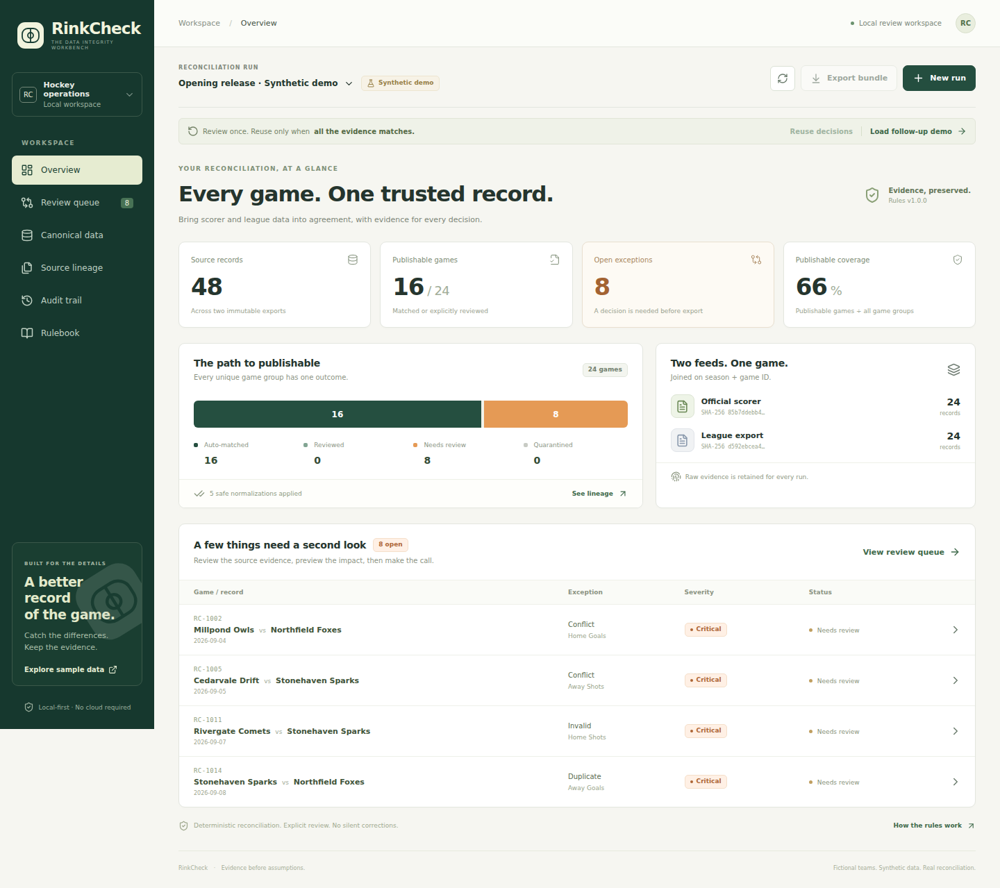
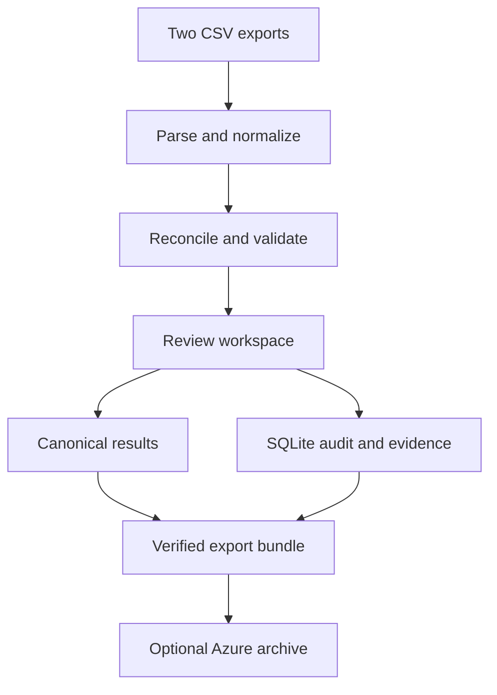

# RinkCheck

**Know which score to trust.** A hockey data-reconciliation workbench for turning conflicting scorer and league exports into reviewed, traceable results.

Inspired by junior hockey and engineering-review automation, RinkCheck addresses a concrete operations problem: two CSV exports describe the same games, but disagree on scores, shots, or missing records. A plausible-looking standings table can still be wrong. This app makes the evidence, review decisions, and downstream consequences visible.

The bundled league, teams, games, and errors are **synthetic demo data**. This is a portfolio application, not a deployed league service.



## Run it

With Docker Compose:

```sh
git clone https://github.com/Mr-Methodical/data-project.git
cd data-project
docker compose up --build
```

Open **http://localhost:8000**. No cloud account, API key, external dataset, or AI service is required. SQLite persists in the `rinkcheck-data` Docker volume. The first launch seeds the opening demo only when the database is empty.

For development, install **Python 3.12** and **Node.js 24**, then:

```sh
make setup
make dev
```

Open **http://localhost:5173**; API documentation is at **http://localhost:8000/docs**. On Windows, use WSL or run the equivalent Python/npm commands from the Makefile. To serve the production build locally, run `make build` followed by `make serve`.

## A five-minute walkthrough

1. Open the seeded release. See how much of the dataset can currently be published and which rules block the rest.
2. Open a score discrepancy in the review queue. Compare the source rows and normalized values; no source is silently assumed correct.
3. Select a valid source record, add your review rationale, and preview the effect on publishable games and standings. Apply the decision.
4. Inspect source lineage and the audit trail. Original values stay available; decisions are recorded separately.
5. Finish the queue by selecting supported records or explicitly quarantining a game. Download the verified export bundle.
6. Load the follow-up release and reuse matching prior decisions. A changed disputed record must receive a new review.

[See the evidence comparison and review interface](docs/screenshots/review.png).

You can also import your own two CSV files using the documented schema and download the sample files directly from the app.

## What is implemented

- **Deterministic reconciliation:** composite `(season, game_id)` identity; explicit team aliases, Unicode/whitespace normalization, strict numeric/date validation, and retained source provenance. Similar names never become a fuzzy join.
- **Explainable exceptions:** cross-source conflicts, contradictory duplicates, missing source records, invalid statistics, and team identity collisions are reviewable evidence.
- **Preview before apply:** compare candidates, inspect changed fields and standings, enter a rationale, then commit one atomic decision. Invalid candidates cannot be selected.
- **Persistent workflow:** immutable import evidence, idempotent ingestion, optimistic version checks, and atomic SQLite transactions prevent partial or stale decisions.
- **Exact decision reuse:** full evidence fingerprints and a rule version gate reuse. Changed source data invalidates earlier review, even if the game ID is unchanged.
- **Traceable exports:** canonical CSV, original CSV files, an audit log, and a manifest with checksums and explicit exclusions. Open exceptions block export. Quarantine is disclosed as reduced coverage.
- **Optional Azure archive:** a separate CLI verifies a completed export bundle and archives it to Azure Blob Storage using identity-based authentication. Local development does not depend on Azure.

## Why the numbers mean what they say

**Publishable coverage** is the percentage of unique game groups currently represented by a validated, automatically matched or human-selected record. An excluded game stays in the denominator. It is not a confidence score or proof that a source reflects reality.

Standings use only final games in the currently publishable subset. The demo policy awards two points for a win, one for a tie, and zero for a loss. This is a deliberately stated policy, not an implementation of every hockey league's overtime rules.

The system cannot establish which source is factually correct. It preserves evidence, applies explicit rules, and records a reviewer's decision. Reviewer names are self-reported labels in this local demo, not authenticated identities.

## Architecture



The reconciliation engine is a pure Python module. FastAPI owns persistence, validation boundaries, concurrency, and export. React/TypeScript owns presentation and calls the same documented API used in tests. SQLite is suitable for this bounded, single-instance demo; the app does not claim distributed storage or production multi-tenant operation.

## Verify it

```sh
make test
make lint
make build
cd frontend
npx playwright install chromium
npm run test:e2e
```

The tests target failure modes that matter: malformed-file rollback, invalid evidence retained for review, safe decision replay after row reorder, changed evidence refusing replay, stale updates, immutable audit history, export gating, and quarantined coverage. Browser tests exercise the actual production build and API together. The included GitHub Actions workflow runs the same checks.

Local verification: **115 backend tests pass with 95% statement coverage**, and **3 Chromium acceptance tests pass** against the production frontend and real API. TypeScript, production build, and Python lint also pass. The Docker configuration and Azure adapter are included; a Docker runtime and live Azure account have not yet been used to verify them.

The bundled opening release contains **48 source rows, 24 game groups, and 8 review cases**. Resolving it and loading the follow-up permits **7 exact-evidence reuses**, while **1 changed case stays open**. These are reproducible synthetic fixture results, not production traffic statistics.

## Project map

| Location | Purpose |
| --- | --- |
| `backend/rinkcheck/engine.py` | Parsing, normalization, matching, validation, standings, CSV |
| `backend/rinkcheck/store.py` | Transactional persistence, review decisions, audit chain |
| `backend/rinkcheck/api.py` | HTTP API, static frontend, preview/replay/export |
| `frontend/src/` | Dashboard, review UI, lineage, standings, audit, imports |
| `fixtures/` | Reproducible synthetic releases and CSV template |
| `backend/tests/` | Engine, API, and independent integrity regressions |
| `frontend/e2e/` | Browser acceptance tests |
| `scripts/archive_to_azure.py` | Optional verified bundle archival |

Read the [data contract](docs/data-contract.md), [architecture decisions](docs/architecture.md), [Azure connection guide](docs/azure.md), and [interview walkthrough](docs/interview-guide.md).

## Boundaries and development notes

The app is intended to run locally for a single operator. Before hosting it for other people, add authenticated users/authorization, tenant isolation, deployment-specific upload/rate limits, backup/restore operations, and an appropriate database. The audit hash chain detects changes against retained hashes; a database administrator who rewrites the whole chain is outside its protection.

Canonical CSV is escaped for spreadsheet-formula safety. The **raw CSV evidence is intentionally unchanged** and should be treated as untrusted input when opened in spreadsheet applications.

This project was built with AI-assisted development. The reviewable evidence is the implementation, deterministic fixtures, and tests. There are no claims of measured productivity gains, production usage, or real-world cost savings for this project.
